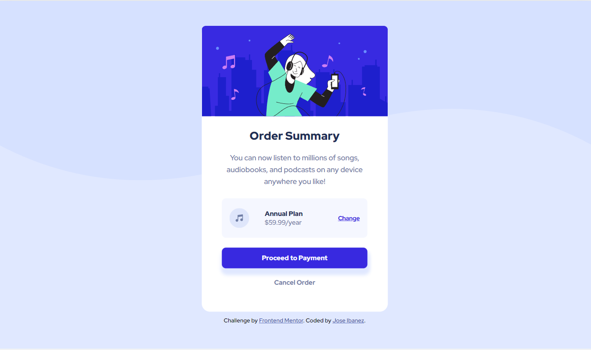

# Frontend Mentor - Product preview card component solution

This is a solution to the [order summary component challenge on Frontend Mentor](https://www.frontendmentor.io/challenges/order-summary-component-QlPmajDUj). 

## Table of contents

- [Overview](#overview)
  - [The challenge](#the-challenge)
  - [Screenshot](#screenshot)
- [My process](#my-process)
  - [Built with](#built-with)
- [Author](#author)

## Overview

In this FrontendMentor challenge i have developed a responsive order summary component card. It has been made following the specifications requested for the challenge and using HTML and SASS

### The challenge

Users should be able to:

- View the optimal layout depending on their device's screen size
- See hover and focus states for interactive elements

### Screenshot

## My process

For the creation of this component I used flexbox for the main card, and the css was done with sass.

### Built with

- Semantic HTML5 markup
- CSS custom properties
- SASS
- BEM
- Flexbox
- Mobile-first workflow

## Author

- Frontend Mentor - [@Ibanezense](https://www.frontendmentor.io/profile/Ibanezense)
- Twitter - [@Josibanezm](https://twitter.com/Josibanezm)

